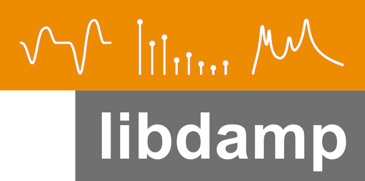

<p align="right">
  
</p>

# libdamp

Framework for experiments with differentiable audio and music processing (DDSP) in PyTorch.

## Table of contents

- [Installation](#installation)
- [Usage](#usage)
- [Project structure](#project-structure)
- [Experiments](#project-structure)
  - [ICASSP2026](#icassp2026)
  - [Vocal Revolutions](#vocal-revolutions)
- [Development](#development)
  - [Running tests](#running-tests)
  - [Code style and consistency](#code-style-and-consistency)
  - [Running the linter on commit](#running-the-linter-on-commit)
  - [Building the documentation](#building-the-documentation)
- [Contributing](#contributing)
- [Citation](#citation)
- [License](#license)
- [Authors](#authors)

## Installation

This project uses [uv](https://docs.astral.sh/uv/) to manage the environment and dependencies. After checking out this repository, install [uv](https://docs.astral.sh/uv/getting-started/installation/) and run:

```
uv sync
```

This creates a `.venv` and installs `libdamp` in editable mode together with its core dependencies, using the versions pinned in `uv.lock`.

To also pull in the optional dependency groups (development tooling, docs), use:

```
uv sync --extra develop --extra doc
```

If you'd rather install into an existing/active environment with `pip`, that works too:

```
pip install -e .
```

## Usage

```python
import libdamp

experiment = libdamp.Experiment(...)
```

A full documentation is available (TODO).

See the [`configs`](configs) and [`experiments`](experiments) directories for example experiment configurations, and [`scripts`](scripts) for entry points used to run them.

## Project structure

```
libdamp/        # library source code (datasets, models, losses, helpers, ...)
configs/        # gin config files for experiments
docs/           # Sphinx documentation sources
experiments/    # Experiment definitions
scripts/        # CLI entry points for running experiments
test/           # unit tests
notebooks/      # Jupyter notebooks with examples and explanations of the algorithms
```

## Experiments

### ICASSP2026

The files in `experiments/ICASSP2026`, `configs/ICASSP2026`, and `notebooks/ICASSP2026` are accompanying the following publication:

```
@inproceedings{SchwaerDBM26_DiffPulse_ICASSP,
  author      = {Simon Schw{\"a}r and Christian Dittmar and Stefan Balke and Meinard M{\"u}ller},
  title       = {Differentiable Pulsetable Synthesis for Wind Instrument Modeling},
  booktitle   = {Proceedings of the {IEEE} International Conference on Acoustics, Speech, and Signal Processing ({ICASSP})},
  year        = {2026},
  pages       = {14792--14796},
  address     = {Barcelona, Spain},
  doi         = {10.1109/ICASSP55912.2026.11462505}
}
```

To reproduce results:
1. Download the [ChoraleBricks](https://zenodo.org/records/20849469) dataset (we used version 1.0.1, but newer versions work too).
2. Preprocess the data following the instructions in the notebook `notebooks/ICASPP2026/preprocess_choralebricks.ipynb`. This creates a folder with separate files for audio, F0 trajectory, gain envelope, etc. in the format that is readable by `libdamp.PulseItDataset`.
3. Update the config variable `PulseItDataset.path` in `configs/ICASSP2026/pulsewave_base.gin`. The default path is `../datasets/ChoraleBricks/libdamp_all`, relative to the main folder of this framework.
4. Run the experiment, for example with `uv run scripts/run.py --config configs/ICASSP2026/pulsewave_base.gin configs/ICASSP2026/instr/01_tp.gin configs/ICASSP2026/mode/pulse_4.gin` for training with trumpet voice 1 and using the pulsetable method with 4 pulses (see the configs folder for other options).
5. Trained models are stored in the `results` folder. You can load them and play around with them using the notebook `notebooks/ICASSP2026/explore_model.ipynb`.

### Vocal Revolutions

The files in `experiments/VocalRevolutions`, `configs/VocalRevolutions`, and `notebooks/VocalRevolutions` are accompanying an art project in collaboration with [Tim Otto Roth](https://imachination.net/) and his [Heaven's Carousel](https://vimeo.com/1102923991).

Coming soon.

## Development

### Running tests

```
uv run pytest
```

### Code style and consistency

This project uses [ruff](https://docs.astral.sh/ruff/) for linting and formatting. Check the repository with (after syncing the `develop` extra):

```
uv run ruff check .
uv run ruff format --check .
```

If you want to run these checks automatically on commit, install the pre-commit hook:

```
uv run pre-commit install
```

This also strips output cells from Jupyter notebooks before they are committed, via [nbstripout](https://github.com/kynan/nbstripout).

### Building the documentation

The API documentation is built with [Sphinx](https://www.sphinx-doc.org/) from the docstrings in [`libdamp`](libdamp) and the sources in [`docs`](docs). After syncing the `doc` extra (see [Installation](#installation)), build the HTML docs with (after syncing the `docs` extra):

```
uv run make -C docs html
```

The output is written to `docs/_build/html/index.html`, which you can open directly in a browser. To remove the build output, run `uv run make -C docs clean`.

## Contributing

Contributions are welcome! Please open an issue to discuss any significant changes before submitting a pull request, and make sure tests and the linter pass beforehand. User-facing changes should be noted in [CHANGELOG.md](CHANGELOG.md).

## Citation

If you use `libdamp` in your research, please cite this research paper the code is accompanying:

```
@inproceedings{SchwaerDBM26_DiffPulse_ICASSP,
  author      = {Simon Schw{\"a}r and Christian Dittmar and Stefan Balke and Meinard M{\"u}ller},
  title       = {Differentiable Pulsetable Synthesis for Wind Instrument Modeling},
  booktitle   = {Proceedings of the {IEEE} International Conference on Acoustics, Speech, and Signal Processing ({ICASSP})},
  year        = {2026},
  pages       = {14792--14796},
  address     = {Barcelona, Spain},
  doi         = {10.1109/ICASSP55912.2026.11462505}
}
```

## License

This project is licensed under the [MIT License](LICENSE).

## Authors

- [Simon Schwär](https://simon-schwaer.de/)
- [Manuel Peters](https://audiolabs-erlangen.de/fau/assistant/peters)
- [Meinard Müller](https://audiolabs-erlangen.de/fau/professor/mueller)
